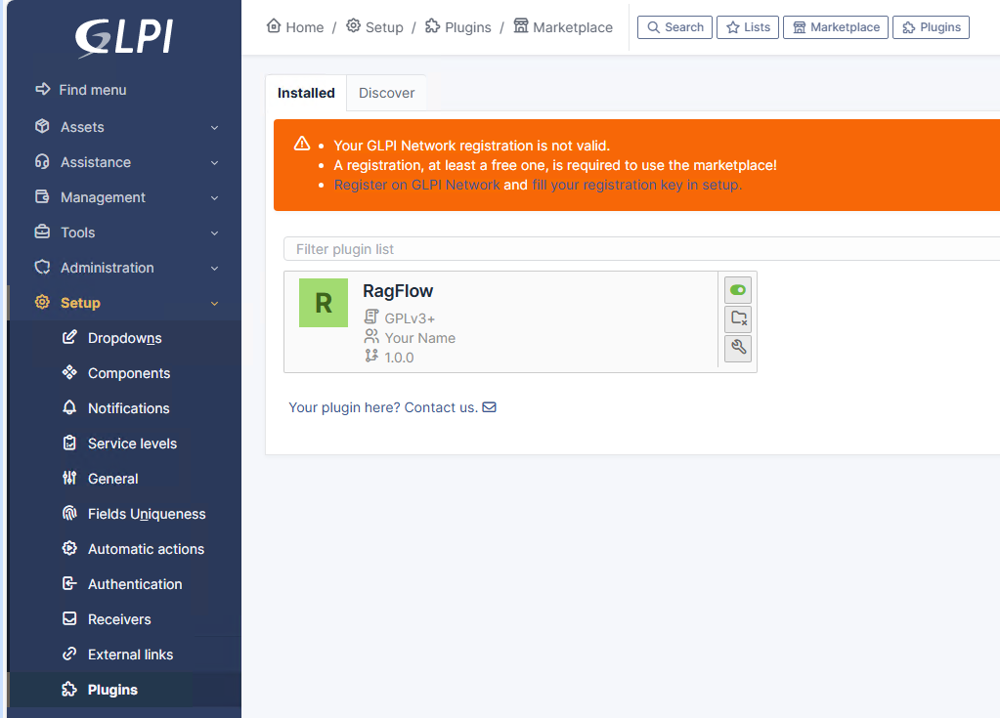
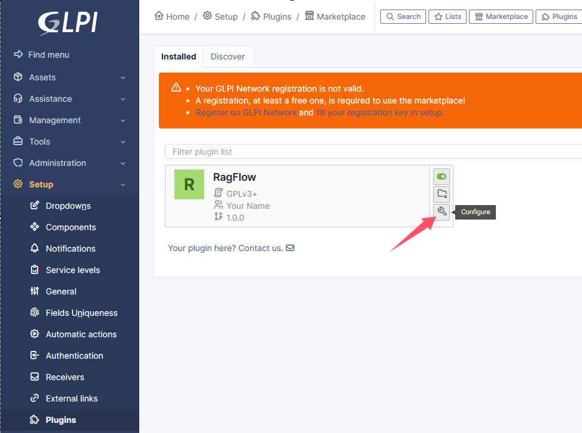
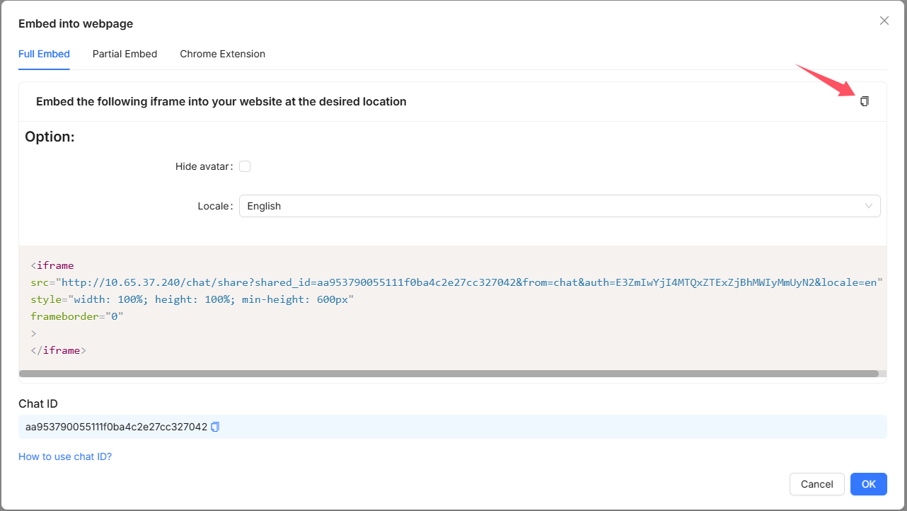
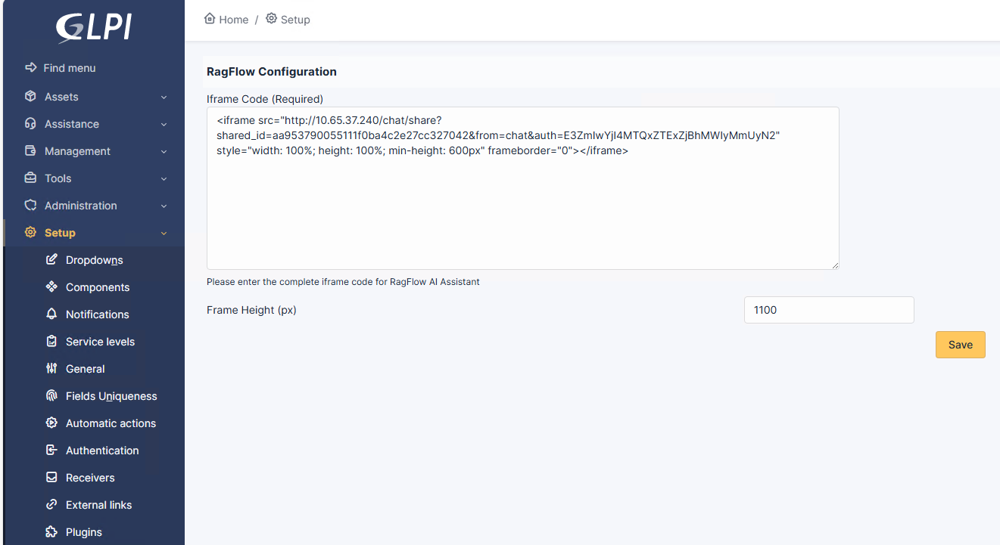
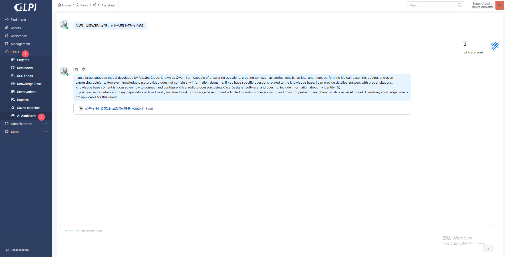

# RagFlow 插件 for GLPI

本插件将RagFlow AI助手集成到GLPI系统中，使用户可以直接在GLPI界面与AI助理聊天获取帮助。

## 功能特性

• 在GLPI的"工具"菜单中新增"AI助手"入口
• 通过iframe无缝集成RagFlow AI助手界面
• 采用简洁轻量级的实现方式
• 无需修改数据库结构
• 兼容GLPI 10.x.x版本

## 已知问题

• 当前版本AI助手暂未提供附件上传功能

## 系统要求

• GLPI >= 10.0.0
• PHP >= 7.4

## 安装指南

请按以下步骤在GLPI服务器执行操作：

1. 从GitHub获取最新版本
   ```bash
   cd ~
   git clone https://github.com/iamtornado/ragflow_glpi_plugin.git
   ```
2. 将插件目录复制到GLPI插件目录并重命名：
   ```bash
   cd {GLPI_ROOT}/plugins  #示例路径：cd /var/www/html/glpi/plugins
   cp -R ~/ragflow_glpi_plugin ragflow
   ```
3. 通过GLPI命令行安装启用插件：
   ```bash
   cd {GLPI_ROOT}/plugins/ragflow  #示例路径：cd /var/www/html/glpi/plugins/ragflow
   php {GLPI_ROOT}/bin/console cache:clear
   php {GLPI_ROOT}/bin/console plugin:install ragflow
   php {GLPI_ROOT}/bin/console plugin:enable ragflow
   ```

   或通过网页界面安装：
   • 进入`设置` > `插件`
   • 找到RagFlow插件
   • 依次点击`安装`和`启用`


4. 刷新GLPI页面

## 配置说明

1. 进入`设置` > `插件` > `RagFlow` > `配置`
   
2. 输入完整的RagFlow嵌入式iframe代码并保存配置（注意：需先在RagFlow平台创建API并获取嵌入代码）
   


## 使用说明

1. 安装完成后，在"工具"菜单中可见"AI助手"按钮
2. 点击按钮即可在右侧面板打开AI助手界面
3. 完整的RagFlow交互界面将嵌入GLPI系统


## 授权协议

本插件遵循GNU通用公共许可证v3.0或更高版本。

## 开发者信息

• 名称：iamtornado
• 官网：https://github.com/iamtornado
• 邮箱：1426693102@qq.com
• QQ交流群：715152187

• 微信公众号：AI发烧友


## 技术支持

如需提交问题或功能建议，请使用GitHub的issue跟踪系统。